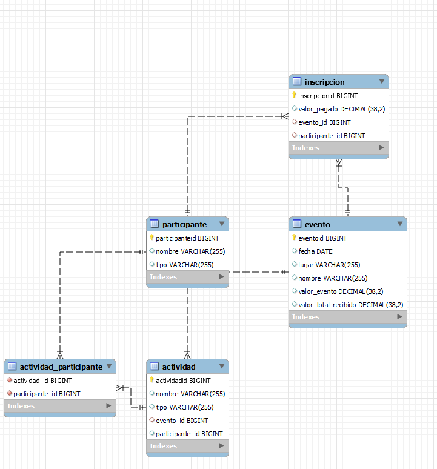

# API SpringBoot para eventos

Esta API proporciona funcionalidad para gestionar eventos académicos y científicos, incluyendo la gestión de eventos, participantes e inscripciones.

## Configuración

Para ejecutar este proyecto, asegúrate de tener Node.js instalado en tu sistema. Luego, sigue estos pasos:

1. Clona este repositorio:

   ```bash
   git clone https://github.com/Yesid-r/eventos.git

La aplicacion se ejecuta en el puerto 8081
2. Obtener todos los eventos
    ```bash
        GET /eventos
Este endpoint devuelve una lista de todos los eventos académicos y científicos registrados en la aplicación.
3. obtener valor total recibido de un evento
    ```bash
    GET  /eventos/valorTotal/1

4. Obtener un evento y sus participantes
    ```bash
        GET /eventos/i
devuelve participantes del evento

5. endponints de save and list de los demas estan correctos

## Diagramas UML
### Modelo entidad relacion: 



## Autores
#### Dairo Yesid Rincon Carreño
#### Esneider Yesid Patiño Rojas